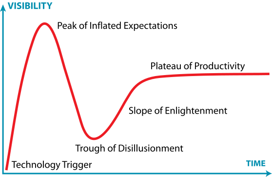

# GPT-5 vs Claude vs Gemini vs Llama: What Real Projects Taught Me

As with most technologies, newer LLMs often look like upgrades. In practice, the right choice depends on the workload.

## What I Learned from Recent Projects

<!-- more -->

- **Coding pipelines**: GPT-5 Pro is excellent at reasoning about repo architecture, but Claude 3.5 Sonnet consistently produced cleaner, working code in less time. Many developers I’ve worked with refuse to switch for this reason.  
- **Enterprise document analysis**: For million-line contracts, Gemini 1.5 Pro’s *2M token* context handled queries GPT-5 (*400K tokens*) simply couldn’t. In long-context retrieval, size matters more than “newness.”  
- **Summarization & internal tools**: Llama 3 (70B) delivered “good enough” summaries at a *50× lower cost per token* than GPT-4/5. For internal apps, the ROI was obvious.  
- **Complex Q&A & reasoning**: GPT-5’s structured reasoning and parallel threads gave it the edge, especially in financial risk modeling and legal analysis.  

## Decision Criteria I Now Use with Clients

1. **Task type**: Reasoning vs. coding vs. summarization vs. others.  
2. **Context needs**: 50K tokens or 2M tokens?  
3. **Budget**: Is $0.70/million tokens sustainable, or is $0.02 good enough?  
4. **Data sensitivity**: Open-source (Llama) vs. hosted (Azure GPT/Gemini).  

## Takeaway

Don’t pick the “newest”. Build a **multi-model playbook**:  
- Route coding to **Claude**  
- Long docs to **Gemini**  
- Cheap summaries to **Llama**  
- Reasoning to **GPT-5**  

That orchestration layer — *not the model brand* — decides success.

