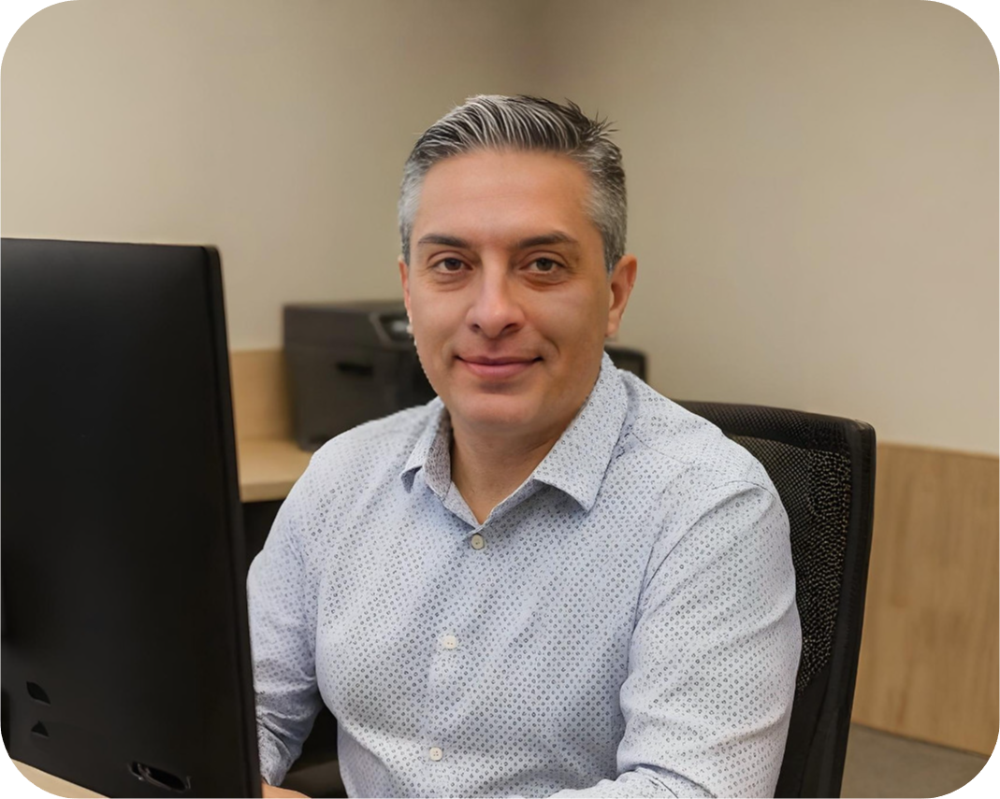

# Hi, I am Olivier - I turn AI concepts into measurable business value

### With 10+ years of AI and strategy expertise across various industries

- Struggling to align AI initiatives with your core business objectives?

- Unsure how to turn AI potential into real ROI and innovation?

- Want to stay ahead by adopting AI before competitors do?

- Need a clear, tailored roadmap for successful AI transformation?

- Looking for a strategist who bridges business vision and technical execution?

[Book a Free AI Strategy Consultation:material-arrow-top-right:](https://cal.com/odepin/introduction-call){ .md-button .md-button--primary }

{ .profile-image alt="Portrait of Olivier DEPIN, AI Consultant and Entrepreneur" }

## About me

Hi! I'm Olivier, an consultant and entrepreneur from France. I help SaaS and digital enterprises unlock the full potential of AI by creating tailored AI Transformation Roadmaps that turn early experimentation into measurable business value. By aligning AI initiatives directly with core objectives, I enable companies to boost ROI, accelerate innovation, and gain a competitive edge.

With over a decade using artificial intelligence, I hold multiple certifications and hands-on experience implementing AI systems across finance, media, and e-commerce. My expertise includes Python, PostgreSQL, machine learning, FastAPI, OpenAI, Claude, Azure, vector databases, RAG, and LLM integration.

## Why me?

What makes me unique — and how I help businesses unlock measurable value:

-   :fontawesome-solid-building-user:{ .lg .middle } Real-World Business Leader

    ---

    As an experienced founder, I combine entrepreneurial perspective with AI expertise, bridging technical implementation and business strategy to deliver solutions that drive ROI and align with core objectives.

-   :material-youtube:{ .lg .middle } Clear Guidance, Effective Communication

    ---

    By converting business needs into technical solutions, I make complex AI concepts easy to understand. You’ll always know the 'why' behind decisions and get clear, consistent updates on progress.

-   :material-school:{ .lg .middle } Seasoned Industry Specialist

    ---

    With more than a decade in AI, IT, and strategy across telecoms, innovation, and e-commerce, I bring proven, hands-on expertise to every project. My solutions are grounded in real-world results, not theory.

-   :material-rocket:{ .lg .middle } Efficient AI strategy

    ---

    I specialize in designing and executing AI implementation roadmaps. Leveraging modern tools and proven frameworks, I guide projects from concept to production efficiently, helping you gain a competitive edge.

## What my past clients say about my work

-   :material-format-quote-open:{ .lg .middle } Jennifer Williams
    
    Founder at Cuddle Clones

    ---

    "Olivier is great to work with! He's organized, responsive, and does great work for us."

## Frequently asked questions

??? note "What’s your earliest availability to begin my project?"
    I usually begin new projects within 1–2 weeks of contract signing. For urgent needs, I offer flexibility and may be able to start sooner—simply share your timeline during our initial consultation.

??? note "Do you have a minimum project commitment?"
    I accept projects of any size, though engagements of 20 hours or more usually deliver the best results. We can also start with a pilot project to confirm the fit.

??? note "Could you share the industries where you’ve gained experience?"
    I’ve delivered successful outcomes across e-commerce, telecoms, innovation, logistics, design, and financial services. My expertise is especially strong in customer needs analysis, organizational strategy, process optimization, and transformation planning.

??? note "How will my data be kept secure and confidential?"
    I treat data security with the highest importance—signing NDAs at project outset, applying enterprise-grade encryption, and adhering to recognized best practices. Where needed, I seamlessly integrate into your organization’s security framework and compliance standards.

??? note "Could you outline your pricing model?"
    My pricing models include both project-based and retainer options. Fees are aligned with scope, complexity, and business value delivered—not just hours worked. For continued collaboration, I provide tailored retainer packages. During consultation, we’ll define the most effective structure for your needs.

??? note "How do you report progress and results?"
    I keep you informed with weekly updates, regular check-ins, and detailed documentation. For ongoing work, interactive dashboards allow you to track progress and results in real time.

-   :material-video-box:{ .lg .middle } Let’s connect and discuss you project!

    ---
    
    Curious if we’re a good fit? Let’s chat. Schedule a complimentary 30-minute strategy session to discuss your AI challenges and explore potential collaboration.

    [Book Free Intro Call :material-arrow-top-right:](https://cal.com/odepin/introduction-call){ .md-button .md-button--primary }

