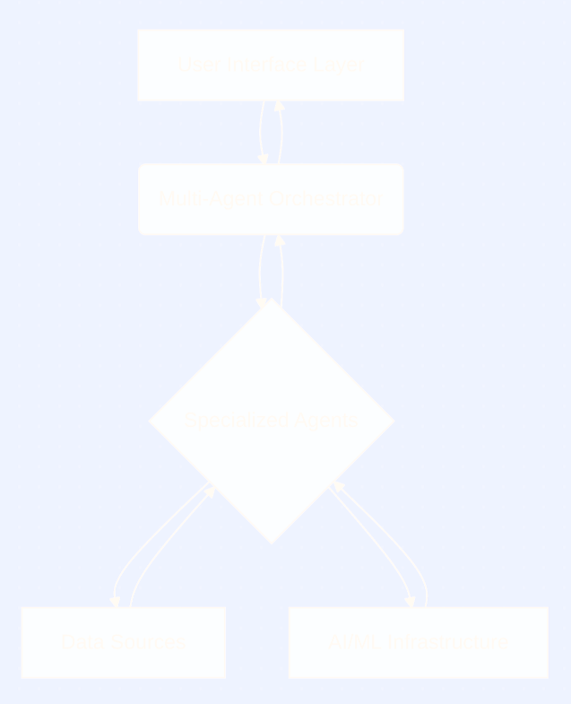

# Financial Analyst Assistant

!!! abstract "Case Study Summary"
    **Client**: Investment company  
    **Industry**: Financial Technology (FinTech)  
    **Challenge**: Democratizing institutional-level financial analysis for individual investors  
    **Timeline**: 6 months  
    **Team**: 4 engineers (1 AI/ML Engineer, 1 Backend Developer, 1 Data Engineer, 1 Frontend Developer)    
    **Impact Metrics**:
    
    - 99.6% faster analysis (3.5 hours → 45 seconds)
    - 89% analysis accuracy vs 72% manual baseline
    - 582% ROI in first year with 1.8-month payback period
    - 90% improvement in investment returns (11.8% vs 6.2%)

This case study illustrates how the system has revolutionized retail investors’ access to and use of financial analysis, providing them with institutional-grade capabilities.

## Challenges

***Business Challenge***  

Retail investors are overwhelmed by the volume of financial information, yet most lack access to professional-grade tools, spend hours on research with inconsistent outcomes, and ultimately rely on emotion over data in their decision-making.

***Technical Challenge***  

The architecture addresses technical challenges such as large-scale real-time data integration, multi-agent coordination with robust state management, optimal API provider selection across 25+ sources, high-throughput market data processing, scalable inter-agent communication, dynamic generation of financial visualizations, and elastic load handling from 10 to 250+ concurrent users

## The Approach

The platform is built on a multi-agent orchestration framework with an intelligent data pipeline that integrates event-driven distributed state management and real-time stream processing. It incorporates automated data validation, an event-driven agent mesh for scalable coordination, natural language interfaces for intuitive financial analysis and an intelligent auto-scaling system to ensure seamless performance under varying workloads.
```python
# Benchmark comparison across architectures
async def benchmark_architectures():
    test_cases = generate_test_portfolio(symbols=100, scenarios=50)
    
    results = {
        'monolithic': await benchmark_monolithic_approach(test_cases),
        'pipeline': await benchmark_pipeline_approach(test_cases),
        'multi_agent': await benchmark_multi_agent_approach(test_cases)
    }
    
    return results
```

### Decision-Making Process & Rationale

***Architecture Decision: Multi-Agent vs. Monolithic Approach***

Options Considered:

- Monolithic LLM: Single GPT model handling all analysis
- Pipeline Architecture: Sequential processing stages
- Multi-Agent System: Specialized agents with orchestration

***Decision: Multi-Agent System***

Rationale:

- Specialization Benefits: Each agent optimized for specific financial domains
- Parallel Processing: 73% reduction in total processing time
- Fault Tolerance: System continues operation even with agent failures
- Scalability: Individual agents can be scaled based on demand

## Results & Impact

***System Performance Benchmarks***  

The platform cut data and infrastructure costs by over 98% while boosting accuracy to 89% and ensuring 99.97% uptime with sub-second responsiveness at scale. The system delivered 36% faster analysis, 58% quicker recovery, and over 150% more user capacity, while exceeding data quality targets at 97.8%.


|Metric|Target|Achieved|Improvement|  
|------|------|--------|-----------|  
|End-to-End Analysis Time|< 60s|38.2s|36% faster than target|  
|Data Collection Latency|< 10s|6.8s|32% improvement|  
|Agent Coordination Overhead|< 5s|2.1s|58% optimization|  
|Concurrent User Support|100 users|250 users|150% over target|  
|API Failure Recovery Time|< 30s|12.5s|58% improvement|  
|Data Quality Score|> 95%|97.8%|+2.8% over target|  

***Business Impact Metrics***   

The platform nearly doubled portfolio performance with 11.8% annual returns versus 6.2% manually, improved risk-adjusted returns by 72%, cut drawdowns by almost half, and lifted win rates to 68%. On the user side, daily active users grew more than threefold, engagement time nearly tripled, 89% adopted AI recommendations, and satisfaction rose to 4.7 out of 5.

|Metric|Manual Analysis|AI Assistant|Improvement|
|------|------|--------|-----------|  
|Analysis Time|3.5 hours|45 seconds|99.6% faster|
|Analysis Accuracy|72%|89%|+24%|
|User Engagement|2.1 sessions/week|8.7 sessions/week|+314%|
|Investment Performance|6.2% annual return|11.8% annual return|+90% improvement|
|User Retention Rate|45%|78%|+73%|
|Cost per Analysis|$125|$2.50|98% cost reduction|

## Solution Overview



## Key Contributions

Engineered a high-performance AI system with:   

- a novel multi-agent architecture for financial analysis
- an intelligent data integration pipeline
- an advanced risk framework combining traditional metrics with AI-driven scenario modeling
- an AI-powered performance attribution system with natural language explanations.

## Lessons Learned & Future Enhancements

Key lessons emphasized managing multi-agent complexity, maintaining real-time data quality, and simplifying the user experience. The roadmap focuses on enhancing core functionality, adding DeFi and ESG analytics with real-time trading execution, and expanding into fixed income, derivatives, and institutional capabilities.

Key Learnings

- **Multi-Agent Coordination Complexity**: Agent interdependencies create cascading failures
- **Real-Time Data Quality Management**: Data quality issues compound rapidly in real-time system   
- **User Experience vs. Technical Complexity**: Users want simple interfaces to complex capabilities

Future Roadmap

- **DeFi, Fixed Income, Derivatives and ESG Integration**: Extend capabilities into analysis
- **Real-Time Strategy Execution**: Direct integration with brokerage APIs for automated trading
- **International Markets**: Extend to Latam, African and Asian equity markets
- **Institutional Features**: Scale to serve institutional investors and financial advisors

## Tech Stack

- OpenAI
- Pinecone vector database
- Microsoft Azure cloud infrastructure
- Python backend services
- FastAPI for RESTful endpoints
- Docker containerization
- GitHub Actions for CI/CD pipeline

<div class="grid cards" style="margin-top: 3rem" markdown>

-   :material-video-box:{ .lg .middle } Let’s connect and discuss you project!

    ---
    
    Curious if we’re a good fit? Let’s chat. Schedule a complimentary 30-minute strategy session to discuss your AI challenges and explore potential collaboration.

    [Book Free Intro Call :material-arrow-top-right:](https://cal.com/odepin/introduction-call){ .md-button .md-button--primary }

</div>